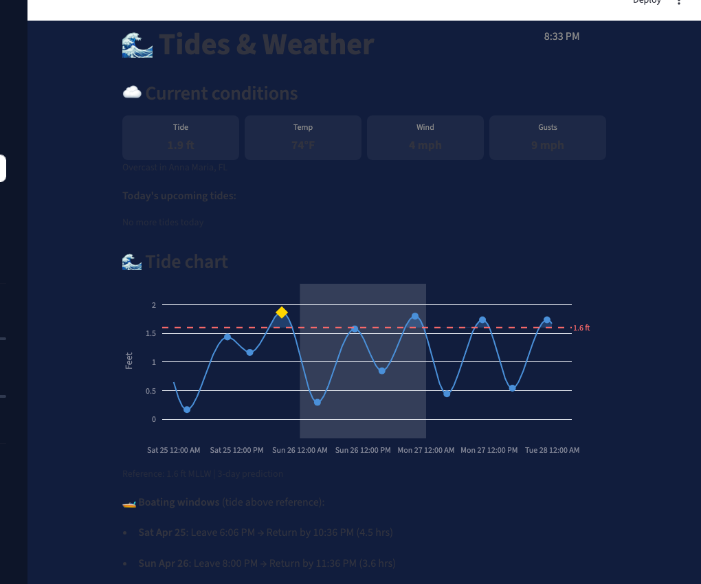
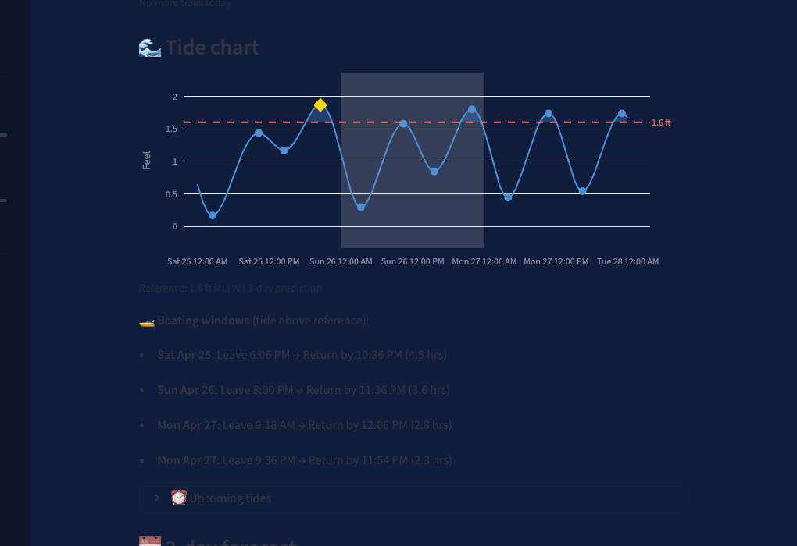
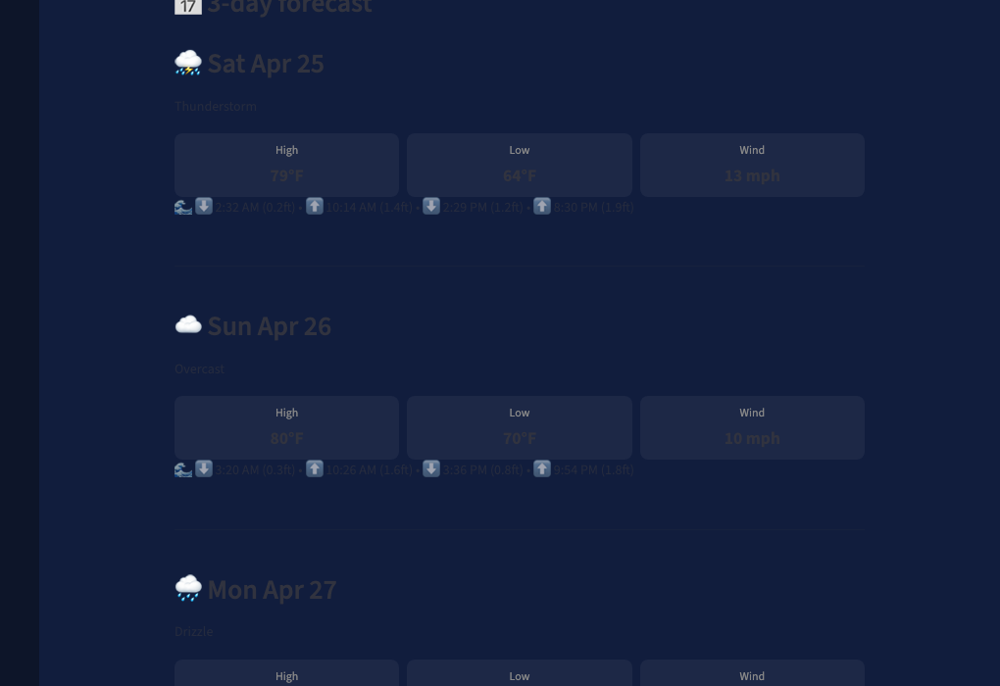

# Tides & Weather

[](https://florida-tides.streamlit.app/)

A Streamlit app for monitoring tides and weather conditions at Florida coastal locations.



## Features

- Current conditions: tide level, temperature, wind speed, gusts
- 48-hour interactive tide chart with configurable reference line
- Boating windows based on tide height above reference
- Upcoming high/low tide times with wind data
- Multi-day forecast with daily weather and tide schedules

### Tide Chart & Boating Windows


### Multi-Day Forecast


## Data Sources

- **Tides**: [NOAA CO-OPS API](https://tidesandcurrents.noaa.gov/api/)
- **Weather**: [Open-Meteo API](https://open-meteo.com/)

## Run

```bash
pip install -r requirements.txt
python3 -m streamlit run tide_app.py
```

---

Built with [Snowflake Cortex Code](https://docs.snowflake.com/en/user-guide/cortex-code/cortex-code)
